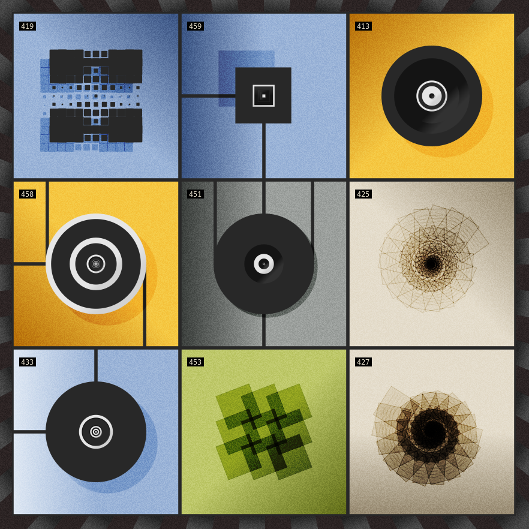

# Panel Competition Image Generator

This project was build by a member of the NFH community and is open for everyone
who wants to try it.

Relevant links:
- [About the Tiles Contest](https://medium.com/@FLAMINGODAO/the-tiles-contest-7187a1bb355d)
- [#panelscontest](https://twitter.com/hashtag/panelscontest)
- [NFH Discord](https://discord.gg/KDqhr9DyEy)

## Requirements
- Python 3.7+
- pip

## Installation
Install the dependencies with:
```bash
pip install -r requirements.txt
```

## Downloading the images
To download all images, use the following command:
```bash
python download.py
```
If you want to use the images from the ones available to NFH, use:
```
python download.py --nfh-only
```

## Usage

**Important: You first need to download the images in order to run the command bellow.**

All parameters described below can be combined.

###To create a random sample from all available images:
```bash
python main.py
```
###If you want to use only images from the ones available to NFH, use:
```bash
python main.py --only-nfh
```
###If you want to remove the block numbers from the image, use:
```bash
python main.py --no-numbers
```
###If you want to use specify the numbers to generate random images from, use:
```bash
python main.py --from-numbers <list_of_numbers_comma_separated>
# Example:
python main.py --from-numbers 419,459,413,458,451,425,433,453,427
```
###If you want to save the image in the end, use:
```bash
python main.py --save
```
The file will be saved on `images/generated` with the name being the block numbers.
###If you want to generate the image, without showing it in the end, use:
```bash
python main.py --dont-show
```
Tip: Use together with `--save` and `--samples` to generate and save images without
showing them in the end.
###If you want to generate multiple samples at once, use:
```bash
python main.py --samples <number_of_samples>
# Example:
python main.py --samples 10
```

## Example

Tiles used: `419, 459, 413, 458, 451, 425, 433, 453, 427`

Resulting file name: `419-459-413-458-451-425-433-453-427.png`

Resulting image (with numbers):

